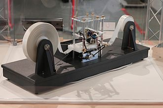
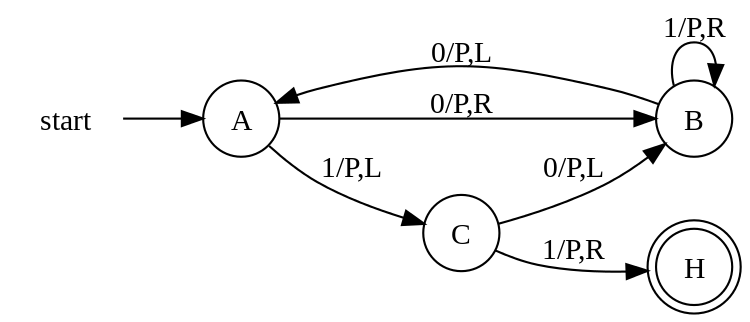
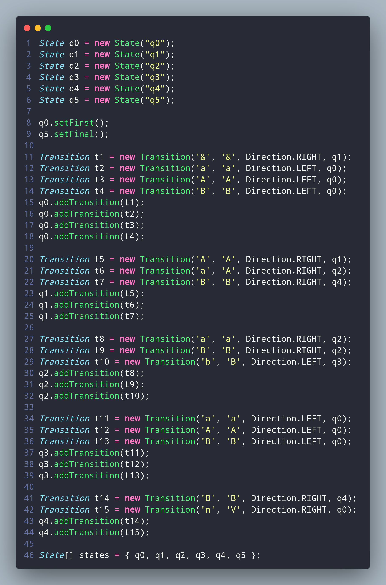

# Turing Machine

A java library to simulate turing machines using automatons.


---

This project is a try to map the idea of turing machines using `OOP` with java.

In general, turing machines are theoretical machines that can compute a bunch of different things, and actually can execute all computational software in it.

This idea, was postulated by `Alan Turing`, considered one of the fathers of computer science, in its idea for solving the [Entscheidungsproblem](https://en.wikipedia.org/wiki/Entscheidungsproblem).

[](https://en.wikipedia.org/wiki/Alan_Turing)

A turing machine can, as simple ways, have 2 parts:

- `infinite tape`: responsible for contain all the symbols, which are `commands` for the machine.
- `reader head`: responsible for read and write in the tape based on the actual instruction.

Every time that the head pass through a symbol, it reads the symbol, and, based on the instruction for that symbol in that `given state`, it writes another symbol and then the machine moves `left` or `right`, and it goes until the last symbol.

The common approach to see that, is using images like these ones:

[](https://en.wikipedia.org/wiki/Turing_machine)
[](https://en.wikipedia.org/wiki/Turing_machine)

However, a more mathematical way is representing it with an automaton.

[](https://en.wikipedia.org/wiki/Turing_machine)

The elements of this graph are:

- circles: representing the machine states
- arrows: representing the transitions between each state
- labels: are the commands for each transition. These commands follow this pattern: (read)/(instruction),(move).
  - read: is the symbol that we expect to read
  - instruction: what we do when a symbol is reached, (like `P` for print, or you can see this a symbol to rewrite the tape).
  - move: the direction that you'll follow in the tape (`LEFT/RIGHT`)
- two circles: the final state. If your program reach it after passing through all the symbols, your the given input is correct and the program executed successfully.

The head will read symbol-by-symbol following the label instructions. Case your input has a symbol that for the actual state doesn't have a transition for it, the program `crashes`, so this input is not accepted by that given machine configuration.

for more details check:

- [Wikipedia](https://en.wikipedia.org/wiki/Turing_machine)
- [Stanford Encyclopedia of Philosophy](https://plato.stanford.edu/entries/turing-machine/)
- [brilliant](https://brilliant.org/wiki/turing-machines/)

## Java implementation

For this project, the idea was to try to abstract all this into classes and objects, then gather all it together in a java-library.

For that was used:

- [gradle](https://gradle.org/)
- [junit4](https://junit.org/junit4/)
- [jdk8](https://www.oracle.com/br/java/technologies/javase/javase8-archive-downloads.html)
- [kotlin](https://kotlinlang.org/)

Case you want to install it, check the [gradle documentation](https://docs.gradle.org/current/samples/sample_building_java_libraries.html).

For `ASDF` users, I recommend you check these plugins:

- [java](https://github.com/halcyon/asdf-java)
- [gradle](https://github.com/rfrancis/asdf-gradle)

For `opensuse` users, I've left a script to install `java` and setup the `JAVA_HOME`, check it [here](./utils/java.sh).  

### Structure

The main structure has 3 elements:

- [Transition](./lib/src/main/java/machine/Transition.java)
- [State](./lib/src/main/java/machine/State.java)
- [Automaton](./lib/src/main/java/machine/Automaton.java)

These have the following methods:

---

#### Transition

| method |  arguments | returns |
|--------|------------|---------|
|constructor|`char read`, `char write`, `Direction direction`, `State next`|-|
|getReadSymbol| - | `char` |
|getAction|-|`Action`|

The direction type is an enum for `LEFT` and `RIGHT`

```java
enum Direction {
    LEFT, RIGHT
}
```

to access it just use:

```java
Direction.LEFT 

or

Direction.RIGHT
```

The Action is an auxiliar class which keeps track of the metadata for a transition, containing:

```java
char write; //symbol to be written
Direction direction; //the tape direction
State next; //the next state
boolean reachedFinal; //if the next state is in the final states set
```

The methods of `Action` are:

| method |  arguments | returns |
|--------|------------|---------|
|constructor|`char read`, `char write`, `State next`, `boolean reachedFinal`|-|
|getWrite| - | `char` |
|getDirection|-|`Direction`|
|getNext|-|`State`|
|getReachedFinal|-|`boolean`|

---

#### State

| method |  arguments | returns |throws|
|--------|------------|---------|------|
|constructor|`String id`|-|-|
|constructor|`String id`, `ArrayList<Transition> transitions`|-|-|
|constructor|`String id`, `ArrayList<Transition> transitions`, `boolean firstState`, `boolean finalState`|-|-|
|addTransition| `Transition transition` | - |-|
|setFinal|-|-|-|
|setFirst|-|-|-|
|isFinal|-|`boolean`|-|
|isFirst|-|`boolean`|
|getId|-|`String`|-|
|test|`char symbol`|`Action`|`TransitionNotFound`|

The [TransitionNotFound](./lib/src/main/java/machine/exceptions/TransitionNotFound.java) exception is for transitions that doesn't exist for a given input char.

---

#### Automaton

| method |  arguments | returns |throws|
|--------|------------|---------|------|
|constructor|`State[] states`, `String tape`|-|`FirstStateException`, `InvalidTape`|
|getTape|-|`String`|-|
|test|-|`boolean`|`TransitionNotFound`|

The [InvalidTape](./lib/src/main/java/machine/exceptions/InvalidTape.java) exception is raised when the given tape has no symbols into.

---

### Example

this is an example of a automaton architecture:


relative automaton:


Note that the `&` marks the start of the tape and the `n` in the code is the same as $\epsilon$ (empty space) in the diagram.

This example searches for sequences as:

```plaintext
aaabbb
aabb
ab
```

and the input tapes looks like:

```plaintext
# code
&aabbn

# automaton
&aabbϵ
```

[`Note: There's an example code in /lib/src/test/examples/App.java check it out`](./lib/src/test/examples/App.java)

## Installation

To install the `machine` library, follow the instruction at [github packages](https://github.com/Dpbm/turing-machine/packages/1996975), you may need [maven](https://maven.apache.org/) for that.

You can also install maven as an `ASDF` plugin:

- [maven](https://github.com/Proemion/asdf-maven)

## Testing

After [installing gradle](https://docs.gradle.org/current/userguide/installation.html) and cloning this repo, you can run the tests by doing:

```bash
./gradlew test
```

## Build

You can also build the project by your own, using:

```bash
./gradlew build
```

## Publishing

To publish this package to a github package, you need to add a `classic token` to you account, and grant the access to read and write packages, to do that take a look at: [github article](https://docs.github.com/en/actions/publishing-packages/publishing-java-packages-with-gradle).

After that, export the `GH_USERNAME` and the `GH_TOKEN` to your environment variables, like:

```bash
export GH_USERNAME="username"
export GH_TOKEN="gh_token"
```

Also, you'll need a `GPG` key to sign the package, follow [the official instructions](https://docs.gradle.org/current/userguide/signing_plugin.html) to ensure that.

Then, run the `gradle publish` to publish to gh packages.

```bash
./gradlew publish
```

alternatively, you can pass the variables along with the `gradlew` command:

```bash
GH_USERNAME="username" GH_TOKEN="gh_token" ./gradlew publish
```

## Contributing

If you want to help this project, feel free to create an issue, make some PRs and text with some other contributors at this repo.
Fix some bugs, add features, fix typos and etc.

*Remember to be kind with everyone!*
